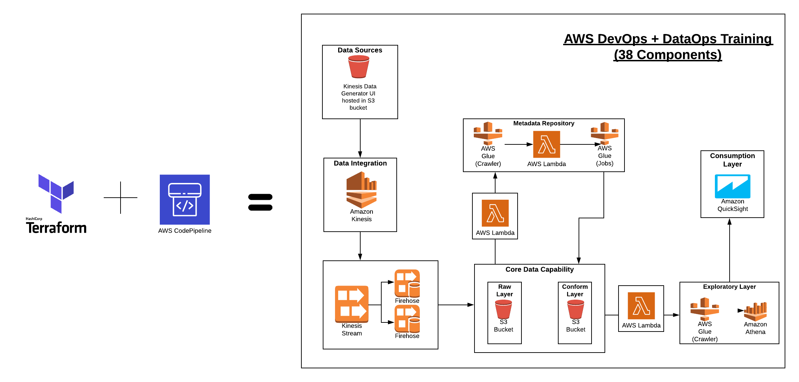

# Automate provisioning the resources on the diagram below on AWS 

1. Change ONLY bucket and dynamodb_table in main.tf to your own name 
2. Create an S3 bucket with the same name as you put in main.tf
3. Create a DynamoDB Table with the same name as you put in main.tf and LockID as the primary key

ref: https://aws.amazon.com/blogs/security/how-use-ci-cd-deploy-configure-aws-security-services-terraform/
